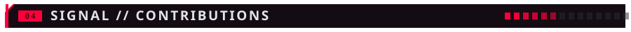
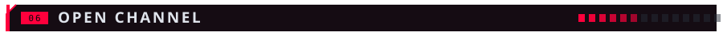

<!--
  ============================================================
  GITHUB PROFILE README  //  Divnoor Singh
  Layout modelled on the GitSkins "founder" template — centered,
  full-width stacked panels — but rendered in the portfolio's own
  cyberpunk theme, with the custom SVG hero banner kept as-is.

  Deploy: put this file + the assets/ folder at the root of a repo
  named  Divnoorheer  (github.com/Divnoorheer/Divnoorheer). GitHub
  renders inline SVG + SMIL, so the banner animates on your profile.

  Regenerate section headers after editing scripts/make-sections.mjs:
      node scripts/make-sections.mjs

  Theme:  void #06060a  base #0b0d12  raised #1a1e27
          yellow #fcee0a  cyan #00f0ff  red #ff003c  teal #16d9c4
  ============================================================
-->

<!-- ░░ HERO ░░ custom notched banner: scanlines · scan sweep · glitch tear ░░ -->

  

  
  &nbsp;
  
  &nbsp;
  

 

<!-- ░░ 00 · BRIEF ░░ -->

  <b>Computer Science 2B @ University of Waterloo</b> 
  I build full-stack products end to end — from local-first AI tooling to 
  cloud-backed compliance systems — and I care about shipping things that 
  actually run, not demos. Currently <b>available for internships</b>.

  
  
  
  

 

<!-- ░░ 01 · CURRENTLY BUILDING ░░ founder-style highlights row ░░ -->

<table width="100%">
<tr>
<td width="33%" align="center" valign="top">

**`▚ LOCAL-FIRST AI`**

Study tooling that runs
OCR, analysis and quiz
generation on-device —
no server required.

</td>
<td width="33%" align="center" valign="top">

**`▚ CLOUD + COMPLIANCE`**

Azure OpenAI systems that
parse regulation and score
technical alignment with
the EU AI Act & GDPR.

</td>
<td width="33%" align="center" valign="top">

**`▚ FULL-STACK PRODUCT`**

TypeScript client-server
apps tuned for fast, secure
sharing and clean, responsive
interfaces.

</td>
</tr>
</table>

 

<!-- ░░ 02 · STACK ░░ -->

<b><code>LANGUAGES</code></b>

  
  
  
  
  
  
  
  

<b><code>FRAMEWORKS &amp; RUNTIME</code></b>

  
  
  
  

<b><code>CLOUD &amp; AI</code></b>

  
  
  
  

<b><code>TOOLS &amp; CONCEPTS</code></b>

  
  
  
  
  

 

<!-- ░░ 03 · BUILDS ░░ -->

<table>
<tr>
<td width="50%" valign="top">

#### `[ Scribble Notes ]`
`React 19 · TypeScript · WASM`

Offline-first AI study platform with local OCR text
extraction, PDF annotation and spaced-repetition
flashcards. A local analysis engine does deterministic
subject-gating for confidence-scored sorting, quizzes
and study analytics — no external server. Optional
Express layer syncs state and supports local LLMs via
Ollama and OpenAI-compatible APIs.

</td>
<td width="50%" valign="top">

#### `[ Dropbin ]`
`Full-Stack · TypeScript`

Full-stack file sharing and snippet manager on a
client-server architecture, with secure data handling,
clean routing and responsive UI. Storage and retrieval
are tuned for fast interactions and quick sharing
workflows.

</td>
</tr>
<tr>
<td width="50%" valign="top">

#### `[ AI Regulatory Compliance Analyzer ]`
`Python · Azure OpenAI`

Analyses technical system alignment with the EU AI Act,
GDPR, ISO standards and Law 25. Automated rule-checking
and structured document parsing for algorithmic
transparency and data-privacy requirements. Produces
compliance reports and risk assessments.

</td>
<td width="50%" valign="top">

#### `[ Stock Market Viewer ]`
`Python · API`

Command-line app fetching real-time financial data,
with secure API key management, robust error handling
and structured views of key market metrics.

</td>
</tr>
</table>

 

<!-- ░░ 04 · SIGNAL / CONTRIBUTIONS ░░
     The snake is generated by .github/workflows/snake.yml and published to
     this repo's `output` branch, so it renders from your own repo and never
     rate-limits. It shows up AFTER the workflow runs once (Actions tab ->
     "contribution-snake" -> Run workflow). Until then GitHub shows the alt
     text. Palette is themed in the workflow to match the portfolio. -->

  <picture>
    <source media="(prefers-color-scheme: dark)" srcset="https://raw.githubusercontent.com/Divnoorheer/Divnoorheer/output/snake-dark.svg" />
    <source media="(prefers-color-scheme: light)" srcset="https://raw.githubusercontent.com/Divnoorheer/Divnoorheer/output/snake-light.svg" />
    
  </picture>

<!--
  ░░ OPTIONAL activity heatmap ░░ a themed contribution line-graph. Hosted
  service (can occasionally rate-limit like the stats cards). Uncomment to use:

  

    
  

-->

 

<!-- ░░ 05 · TELEMETRY ░░ static badges: reliable, never rate-limited ░░ -->

  
  
  

<!--
  ░░ OPTIONAL richer graph cards ░░ the shared public services get rate-limited
  and show a broken image. Self-host first, then uncomment + swap YOUR-APP:
    1. Fork github.com/anuraghazra/github-readme-stats
    2. Create a GitHub PAT (classic, no scopes needed for public data)
    3. Import the fork into Vercel, add env var PAT_1=<token>, deploy
    4. Swap github-readme-stats.vercel.app -> YOUR-APP.vercel.app

  

    
    
  

-->

 

<!-- ░░ 06 · OPEN CHANNEL ░░ -->

  
  
  
  

  <code>REC PERSONNEL/001 · CLASS CS-2B · ORG UWATERLOO · STATE ACTIVE</code> 
  <code>&gt; connection closed // homage to the aesthetic, all assets original</code>

